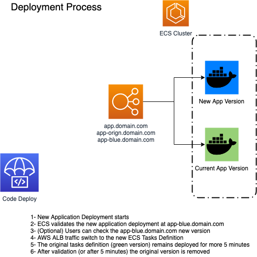

# DNX NodeJS API Sample app

[](https://gitlab.com/DNXLabs/app-nodejs-api/commits/master)

Simple NodeJS API using Docker, ECR, ECS and GitlabCI.
This project aims to demontrate all the steps involved in a fresh API project to be deployed into AWS following DNX One platform.

## Application Architecture

The application is packeed using Docker containers and is deployed into AWS using the following services:

-   AWS ECS
-   AWS CodeDeploy
-   AWS Application Load Balancer
-   AWS Route53
-   AWS EFS
-   AWS CloudFront
-   AWS CloudWatch Logs
-   AWS IAM Roles


## Application build and deploy steps

This application follows the [Three Musketeers](https://3musketeers.io/) pattern relying on on Make, Docker and Docker-Compose to execute all steps involved:

-   downlaod application dependencies (make install)
-   application build (make build)
-   application unit tests (make test)
-   applictation linting (make lint)
-   application docker build (make docker build)
-   application run locally (make run)

The same make file also handles the CICD steps to perform Continuous Integration and Delivery:

-   AWS ECR Login
-   AWS ECR Push
-   AWS AssumeRole to different AWS accounts
-   AWS Deploy (Code Deploy Blue-Green)
-   Smoke Test
-   Application Rollback deployment


## Application dependencies

In order to add this app on AWS stack a set of infrastructure steps must be performed:

-   Add Application ECR Repository
-   Add Application DNX-One ECS Stack
-   Add Deployment files
-   Run CICD Pipeline

### Add Application ECR Repository

All Docker applications must be stored in a private Docker repository (AWS ECR provides that service).


The ECR registry belongs to the Mgmt Account and all necessary work must be performed into the **infra-dnx-mgmt-ci** project.
Steps:

-   Clone the **infra-dnx-mgmt-ci** project
-   Create a feature branch to add a new ECR Repo
-   create a new terraform file module-ecr-app-name.tf (module-ecr-app-nodejs-api.tf)
-   Add the following terraform code:

```terraform
module "ecr_app_nodejs_api" {
  source = "git::https://github.com/DNXLabs/terraform-aws-ecr.git?ref=0.0.1"

  name = "app-nodejs-api"

  trust_accounts = [
    "${data.aws_ssm_parameter.mgmt_account_id.value}",
    "${data.aws_ssm_parameter.nonprod_account_id.value}",
    "${data.aws_ssm_parameter.prod_account_id.value}",
  ]
}
```

-   Push the code to the remote git repository
-   Create a Pull Request to master
-   Wait for the approval
-   When reviewd and approved, it will trigger a CICD proccess to apply the change across the AWS environments

### Add Application DNX-One ECS Stack

Each Docker application shares some AWS resources in each environemt, those resources are assume dto be provisioned before the application deployment. All resources are stored into the **_infra-dnx-ecs-platform_** project.
Common AWS Resources for ECS Applications:

-   Application Load Balancer
-   AWS EFS
-   AWS Route53 Public Zone
-   AWS ACM SSL certificates

For each application the follow steps must be performed:

-   Clone the **infra-dnx-ecs-platform** project
-   Create a feature branch to add the new application
-   Create a new terraform file ecs-app-name.tf (ecs-app-nodejs-api)
-   Add the following terraform code:

```terraform
module "ecs_app_nodejs_api" {
  source                 = "git::https://github.com/DNXLabs/terraform-aws-ecs-app.git?ref=0.1.0"
  vpc_id                 = "${data.aws_vpc.selected.id}"
  cluster_name           = "${module.ecs_apps.ecs_name}"
  service_role_arn       = "${module.ecs_apps.ecs_service_iam_role_arn}"
  task_role_arn          = "${module.ecs_apps.ecs_task_iam_role_arn}"
  alb_listener_https_arn = "${element(module.ecs_apps.alb_listener_https_arn, 0)}"
  alb_dns_name           = "${element(module.ecs_apps.alb_dns_name, 0)}"
  name                   = "nodejs-api"
  image                  = "nginxdemos/hello:latest"
  container_port         = 300
  hostname               = "nodejs-api.${local.workspace["hosted_zone"]}"
  hostname_blue          = "nodejs-api-blue.${local.workspace["hosted_zone"]}"
  hostname_origin        = "nodejs-api-origin.${local.workspace["hosted_zone"]}"
  hosted_zone            = "${local.workspace["hosted_zone"]}"
  healthcheck_path       = "/health"
  certificate_arn        = "${data.aws_acm_certificate.domain_host_us.arn}"
}
```

-   Notes: The application must expose a HelthCheck API, this endpoint is used to ALB to validate when the application is ready to accepts trraffic.
-   What will be created:
    -   AWS CodeDeploy Application
    -   Aws ECS TaskDefinition and Service based on NGINX Image as a palceholder
    -   AWS Route53 Records (DNS)
    -   AWS CloudFront Distribuition
    -   AWS ALB Routes
    -   AWS CloudWath Log groups
-   Push the code to the remote git repository
-   Create a Pull Request to master
-   Wait for the approval
-   When reviewd and approved, it will trigger a CICD proccess to apply the change across the AWS environments

Note: If the application requires any additional AWS service (S3, SSM Parameters, SQS or SNS etc..) all those resources must be added in the same terraform file ecs-app-name.tf, the below saple depicts some AWS SSM parameters for one application

```terraform
resource "aws_ssm_parameter" "google_maps_api_key" {
  name  = "/${local.workspace["account_name"]}/GOOGLE_MAPS_API_KEY"
  value = "someSecureValue"
  type  = "SecureString"

  lifecycle {
    ignore_changes = ["value"]
  }
}
```

### Add Application Deployment Files

Now that al necessary AWS resources were provisioned, the application is ready to be deployed.
For the local environemnt the following commands help to install/build/run the application

```bash
make install
```

Make install runs npm install under a nodejs docker image

```bash
make build
```

Make build runs npm build under a nodejs docker image

```bash
make dockerBuild
```

Make dockerBuild package the application using Docker. Once created the Docker image can be accessd locaclly

```bash
make run
```

Make run execute the docker and send all necessary environment variables contained into the .env.template file
To interact with the docker image the following command can be executed

```bash
make shell
```

Make shell will ssh into the docker image and allow the execution of any shell script inside de image.

### Run CICD Pipeline Steps

This project is based on GitLabCi pipeline, all rules are contained into the .gitlab-ci.yml file.
The pipeline covers all steps needed to enforce a quality and read to deploy application.

-   Commit Phase (executed on every branch, including feature branches)
    -   make install
    -   make test
    -   make style-check
-   DockerBuild Phase (only master)
    -   make dockerBuild
-   DockerPush (only master)
-   Deploy to non-prod
    -   make assumeRole (custom environemnt variables)
    -   make deploy (custom environemnt variables)
-   Slack Notification for manual approval
-   Deploy to prod (manual approval)
    -   make assumeRole (custom environemnt variables)
    -   make deploy (custom environemnt variables)

### Application Deployment Process

This applicaiton uses AWS CodeDeploy to perform Zero-Downtime and Blue/Green Deployments into the AWS ECS Cluster.

